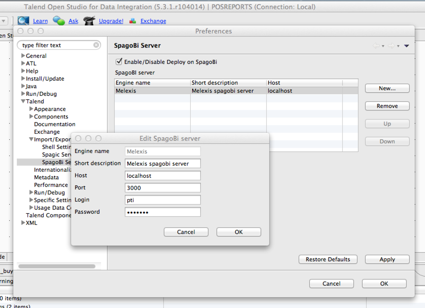

casproxy
========

## Overview

Currently the Talend workbench cannot connect to a CAS protected
SpagoBI Server. This program creates a local proxy server on
localhost:3000 which routes the requests to the real server.

## Principle

The app starts a webserver which transparently forwards the requests
to the remote SpagoBI server. The app which needs access to the
SpagoBI is configured to connect to localhost:3000.

When the response indicates a redirect to the CAS server to login, the
login form is filled in with the username and password of the user to
connect as, and the redirect back to the SpagoBI server is
followed. The calling application is unaware of the login procedure.

## Configuration

Copy the *casproxy.properties* template to *~/.casproxy.properties*.

    cp casproxy.properties ~/.casproxy.properties
    chmod 0600 ~/.casproxy.properties
    vi ~/.casproxy.properties

### login-url

This parameter is matched to detect the redirect to the CAS
server. Best is to copy this from the browser location bar when
logging in. Use the part before the '?' as a good prefix to detect the
login redirection.

### username and password

These parameters are filled in in the CAS login forms.

### scheme

This is the scheme, either *http* or *https*, to connect to the
SpagoBI server. This may or may not be the same as for the CAS server.

### server-name and server-port

This is the fully qualified SpagoBI server-name and the port number to
connect to.

## Application Configuration

Configure the application to use http://localhost:3000 as the
protocol/server/port combination.

The username and password are ignored AFAICT, since the values from
the config file will be used.

When deploying a job to the SpagoBI server from the Talend Workbench
you'll see the following output if everything is ok.

    casproxy git:(master) ✗ lein run
    2013-09-30 00:46:33.120:INFO:oejs.Server:jetty-7.6.8.v20121106
    2013-09-30 00:46:33.150:INFO:oejs.AbstractConnector:Started SelectChannelConnector@localhost:3000
    "Starting request : /SpagoBITalendEngine/EngineInfoService"
    " Status: 302"
    "Logging in to CAS\n"
    "  Submitting Form:"
    "  Following to payload."
    "Starting request : /SpagoBITalendEngine/EngineInfoService"
    " Status: 200"
    "Starting request : /SpagoBITalendEngine/EngineInfoService"
    " Status: 200"
    "Starting request : /SpagoBITalendEngine/JobUploadService"
    " Status: 200"

## Notes

### Generic CAS proxying.

I do not think there is anything specific to SpagoBI or Talend in the
code, so it should work for other combinations where the server is
protected by CAS and the client does not support it.

Let me know if you have issues so I can have a look, or even better,
send a pull request.

### Security

The server only listens on localhost, which means that other people
logged into the same box can connect to the server.

Nothing is written to disk, not the cookies, not any stuff received
from the client or the server.

Currently the password is in plain text in the config file, so be
careful with the access rights and who you show the config to.

### Todo: better security

A practical way to limit access and reduce configuration is to force
on the first connect a login using basic authentication, and use the
username/password to connect to the CAS server in a transparent way.

This is straightforward to do for the single user case, however in the
multiuser case, the current single cookie-store must be changed. Every
account should have their own cookie-store.
